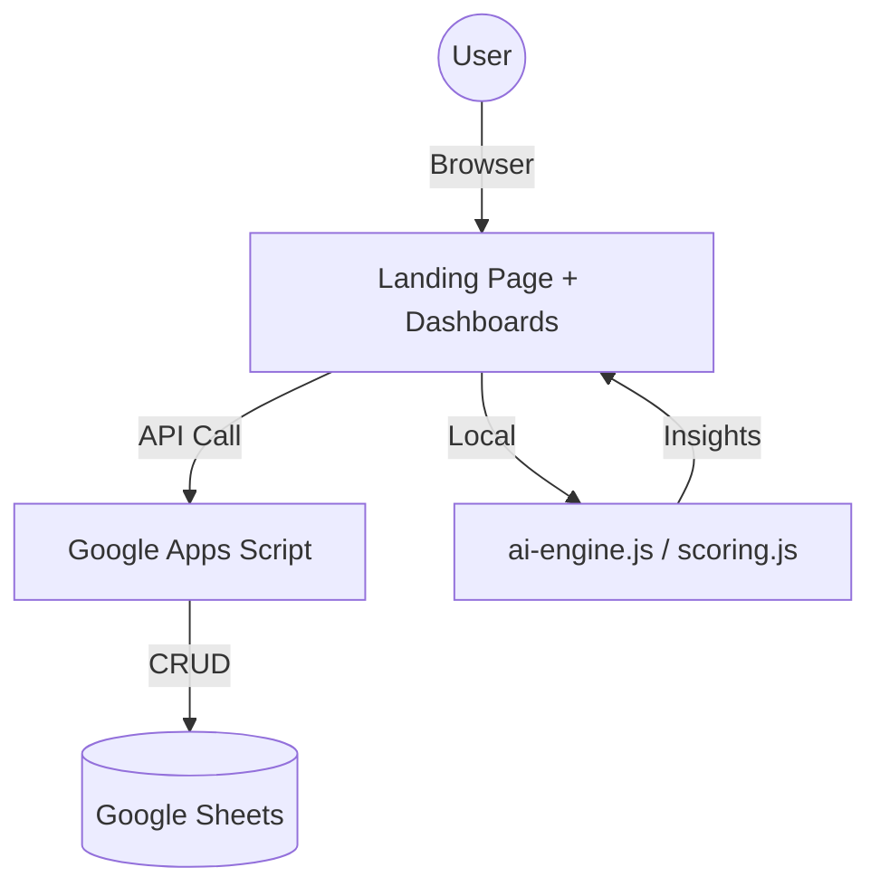

# 📖 System Documentation: Smart City KPI Platform v3.2

> **Smart City Municipal Performance Management System (AI-Driven)**
> VERSION: 3.2 (Performance Optimized + Security Hardened)
> UPDATED: 11/03/2026 20:15
> 📋 See: [RELEASE_NOTES_V3.md](./RELEASE_NOTES_V3.md) for full changelog

---

## 1. 🏗️ System Architecture

- **Frontend**: HTML5, Vanilla CSS3 (Custom Design System), JavaScript (ES6+)
- **Backend/API**: Google Apps Script (Web App URL)
- **Database**: Google Sheets (Cloud Storage)
- **AI Engine**: Client-side JavaScript (Statistical Logic & NLP)
- **Testing**: Vitest — 15/15 Unit Tests Passing
- **Hosting**: Vercel (Static Site) — `vercel.json` configured

### Data Flow


---

## 2. 🖥️ Interface & Features

### 🏠 Landing Page — v3.2 (Lighthouse Optimized)
**Dark Glassmorphism UI** รองรับทุกหน้าจอ (400px–1920px+)
- Non-blocking Google Fonts (FCP optimization)
- GPU-composited background blobs (`will-change: transform`)
- Semantic landmarks: `<main>`, `<nav>`, `<header>`, `<footer>`
- Heading hierarchy: `h1` → `h2` (ไม่ข้ามระดับ)
- Skip link สำหรับ keyboard / screen-reader users
- Focus-visible styles ครบทุก interactive element
- `aria-hidden` บน decorative SVGs
- `prefers-reduced-motion` animation support
- Open Graph + Twitter Card meta
- JSON-LD Structured Data (WebApplication schema)

### 📊 Executive Dashboard
แสดงภาพรวมความสำเร็จของเมืองรายยุทธศาสตร์ พร้อม AI Performance Insights ภาษาไทย

### 🧠 Intelligent Reports (AI-Driven)
ระบบรายงานตรวจจับ KPI วิกฤต ด้วย Linear Regression และ Z-Score Analysis

### 📘 User Manual
คู่มือการใช้งาน Built-in รองรับทุกบทบาท

### 🔐 Admin Back-Office
RBAC, Audit Logs, User Management

---

## 3. 🧠 Smart Capabilities

| Feature | Implementation | Goal |
|---|---|---|
| **Trend Forecast** | Linear Regression (OLS) | พยากรณ์ผลงาน 3 เดือน |
| **Risk Detection** | Z-Score & Target Gap | ตรวจ KPI วิกฤต |
| **AI Insights** | Rule-based Thai Text Generation | สรุปผลภาษาไทย |
| **Scoring Engine** | Weighted Average | คะแนนรวมถ่วงน้ำหนัก |

---

## 4. 🧪 Testing

| Tool | Command | Status |
|---|---|---|
| **Vitest** | `npm test` | ✅ 15/15 Pass |

---

## 5. ⚙️ First-time Setup (Quick Start)

สำหรับนักพัฒนาที่รับงานต่อ ทำตามขั้นตอนนี้เพื่อติดตั้งและรันระบบได้ทันที:

```bash
# 1. Clone repository
git clone https://github.com/poppatompong-dev/KPI_Dashboard
cd KPI_Dashboard

# 2. Install dependencies
npm install

# 3. Start local dev server
npm run dev   # → http://localhost:5173

# 4. Run unit tests
npm test
```

**ขั้นตอน Google Apps Script (Backend):**
1. คัดลอกโค้ดจาก `apps-script/Deploy.gs`
2. เปิด [Google Apps Script](https://script.google.com) → สร้าง project ใหม่
3. วางโค้ด → คลิก **Deploy** → **New Deployment** → **Web App**
4. ตั้งค่า **Who has access**: `Anyone`
5. คัดลอก **Web App URL** ที่ได้รับ
6. นำ URL ไปเพิ่มใน **Vercel Environment Variables** ชื่อ `GAS_URL`

> [!CAUTION]
> **GAS Web App URL ต้องไม่ถูก commit ลง public repository** เด็ดขาด
> URL นี้ทำหน้าที่เป็น unauthenticated API endpoint — ผู้ที่มี URL สามารถ read/write ข้อมูลได้
>
> **จัดการ Local Development:**
> ```bash
> cp config.example.js config.js   # config.js ถูก gitignore แล้ว
> # แก้ config.js ใส่ GAS URL จริงเข้าไป
> ```
> เพิ่ม `<script src="config.js"></script>` ใน HTML ที่ต้องการใช้ API (local only)
>
> **จัดการ Production (Vercel):**
> Vercel Dashboard → Settings → Environment Variables → เพิ่ม `GAS_URL`

**ขั้นตอน Google Sheets:**
- สร้าง Google Sheet ใหม่ → Share กับ GAS Service Account
- Sheet tabs ที่จำเป็น: `KPI_Master`, `KPI_Results`, `Departments`, `Users`
- อย่าเปลี่ยน header แถวที่ 1 ของแต่ละ tab เพราะ GAS อ้างอิงตาม column name

**System Owner / Contacts:**
| ทรัพยากร | เจ้าของ / ขอสิทธิ์จาก |
|---|---|
| Google Sheet | นักวิชาการคอมพิวเตอร์ |
| GAS Deployment | นักวิชาการคอมพิวเตอร์ |
| Vercel Project | นักวิชาการคอมพิวเตอร์ |
| GitHub Repository | poppatompong-dev |

---

## 6. 🚀 Deployment

### Vercel (Production)
1. Push code → GitHub `main` branch
2. Vercel auto-deploys ทันที (zero-config)

**Security Headers** (ผ่าน `vercel.json`):
- `Strict-Transport-Security` (HSTS)
- `X-Frame-Options: SAMEORIGIN`
- `Cross-Origin-Opener-Policy: same-origin`
- `X-Content-Type-Options: nosniff`
- Cache-Control: CSS/JS immutable, HTML must-revalidate

### SEO Files
- `/robots.txt` — Allow all crawlers
- `/sitemap.xml` — All major pages indexed

---

## 6. ⚡ Lighthouse Optimization Summary

| Dimension | Key Fixes Applied |
|---|---|
| **Performance** | Non-blocking fonts, GPU blobs, CSS preload, reduced-motion |
| **Accessibility** | Skip link, landmarks, heading order, focus-visible, aria-hidden, contrast |
| **Best Practices** | HSTS, X-Frame-Options, COOP, Cache-Control headers |
| **SEO** | canonical, robots.txt, sitemap.xml, JSON-LD, OG tags |

---

## 7. 🛠️ Maintenance

1. **Google Sheet**: อย่าเปลี่ยน Header แถว 1
2. **GAS**: ทุกครั้งที่แก้ไข `Deploy.gs` → "New Deployment"
3. **Landing CSS**: แก้ใน `<style>` ใน `index.html`
4. **Links**: ห้ามเปลี่ยนชื่อไฟล์ `.html` ในโฟลเดอร์ราก

---

## 🎖️ Developer Credits
**นักวิชาการคอมพิวเตอร์** — กองยุทธศาสตร์และงบประมาณ เทศบาลนคร
*"Transforming Municipal Data into Intelligent Decisions"*

---

📋 See also: [RELEASE_NOTES_V3.md](./RELEASE_NOTES_V3.md) for full version changelog
