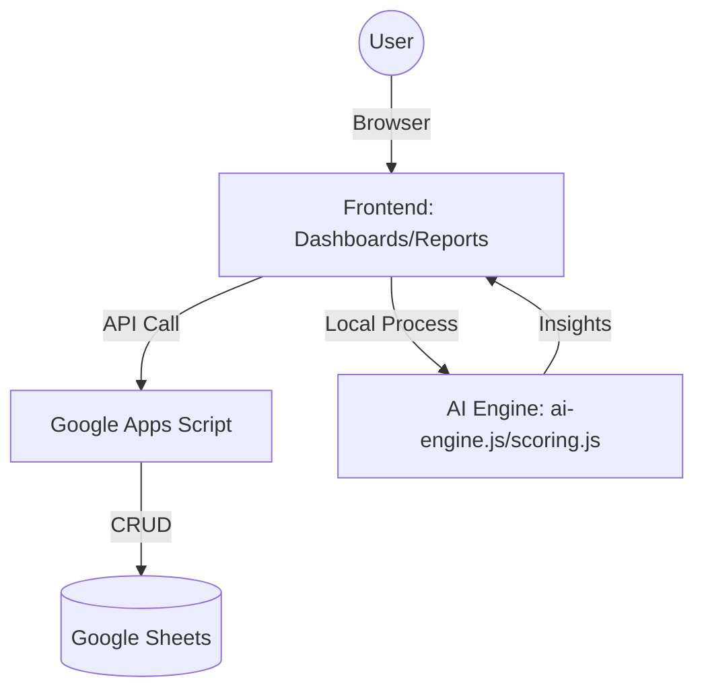

# 📖 System Documentation: Smart City KPI Platform v3.1

> **Smart City Municipal Performance Management System (AI-Driven)**
> พัฒนาโดย: นักวิชาการคอมพิวเตอร์ เทศบาลนคร
> VERSION: 3.1 (Stable)
> UPDATED: 11/03/2026 19:45

---

## 1. 🏗️ System Architecture

ระบบถูกออกแบบให้เป็น **Serverless Web Application** โดยใช้โครงสร้างพื้นฐานของ Google Workspace:

- **Frontend**: HTML5, Vanilla CSS3 (Custom Design System v2), JavaScript (ES6+)
- **Backend/API**: Google Apps Script (Deployment via Web App URL)
- **Database**: Google Sheets (Cloud Storage)
- **AI Engine**: Client-side JavaScript Processing (Statistical Logic & NLP)
- **Testing**: Vitest Unit Test Suite (15 tests covering ScoringEngine & AIEngine)
- **Hosting**: Static Site — รองรับ Vercel Deployment (`vercel.json`)

### Data Flow Diagram


---

## 2. 🖥️ Interface & Key Features

### 🏠 Landing Page (Home) — v3.1 Redesign
หน้าแรกใหม่ออกแบบด้วย **Dark Glassmorphism UI** รองรับ Mobile Responsive ทุกขนาดจอ (400px–1920px+)
- Dark background `#0a0c14` พร้อม Ambient Light Effects (Blur blobs)
- 4 Role Cards พร้อม Hover glow effects และ micro-animations
- Admin Back-Office Card แบบ Full-Width Gradient Border
- Animated ping indicator แสดงสถานะระบบ Online

### 📊 Executive Dashboard
แสดงภาพรวมความสำเร็จของเมืองรายยุทธศาสตร์ พร้อม AI Performance Insights สรุปผลงานเป็นข้อความภาษาไทย

### 🧠 Intelligent Reports (AI-Driven)
ระบบรายงานที่คำนวณความเสี่ยงล่วงหน้า โดยใช้หลักการทางสถิติเพื่อตรวจจับตัวชี้วัดที่วิกฤต

### 📘 User Manual
คู่มือการใช้งานแบบ Built-in ช่วยให้ผู้ใช้งานใหม่เริ่มต้นได้รวดเร็ว แบ่งตามบทบาทงาน

### 🔐 Admin Back-Office
ส่วนจัดการความปลอดภัยและการตั้งค่าระบบ (RBAC, Audit Logs, User Management)

---

## 3. 🧠 Smart Capabilities (AI & Logic)

| Feature | Technical Implementation | Goal |
|---------|-------------------------|------|
| **Trend Forecast** | Linear Regression (Ordinary Least Squares) | พยากรณ์ผลงานในอีก 3 เดือนข้างหน้า |
| **Risk Detection** | Z-Score & Target Gap Analysis | ตรวจพบ KPI ที่มีโอกาสไม่บรรลุเป้าหมาย |
| **NLP Insights** | Context-aware Thai Text Generation | แปลงตัวเลขให้เป็นข้อสรุปที่ผู้บริหารอ่านเข้าใจง่าย |
| **Scoring Engine** | Weighted Average & Status Mapping | คำนวณคะแนนรวมเมืองโดยถ่วงน้ำหนักตามความสำคัญ |

---

## 4. 🧪 Testing Infrastructure

| Tool | Command | Coverage |
|------|---------|----------|
| **Vitest** | `npm test` | ScoringEngine (9 tests), AIEngine (6 tests) — **15/15 Pass** |

ไฟล์ทดสอบ: `tests/scoring.test.js`, `tests/ai-engine.test.js`

---

## 5. 🚀 Deployment

### Local Development
```bash
npm run dev   # Vite dev server → http://localhost:5173
npm test      # Run unit tests
```

### Vercel Deployment
โปรเจคพร้อม Deploy ขึ้น Vercel ทันที ผ่านไฟล์ `vercel.json`
1. Push โค้ดขึ้น GitHub: `https://github.com/poppatompong-dev/KPI_Dashboard`
2. Import repo เข้า Vercel Dashboard
3. Deploy — ไม่ต้องตั้งค่าเพิ่มเติม (Static Site)

### Google Apps Script (Backend)
1. คัดลอกโค้ดจากไฟล์ `apps-script/Deploy.gs`
2. นำไปวางใน Google Apps Script Editor
3. คลิก **Deploy** > **New Deployment** > **Web App**
4. ตั้งค่า **Who has access** เป็น **"Anyone"**
5. อัปเดต URL ใน `js/api.js`

---

## 6. 🛠️ Maintenance Guide

1. **Google Sheet**: อย่าเปลี่ยนชื่อหัวตาราง (Header) ในแถวที่ 1 ของแต่ละ Sheet
2. **GAS Deployment**: ทุกครั้งที่มีการแก้ไข `Deploy.gs` ให้เลือก "New Deployment"
3. **Styles**: แก้ไข `css/styles.css` (CSS Variables ใน `:root`) หรือ `<style>` ใน `index.html` สำหรับ Landing Page Theme
4. **Landing Page Links**: ทุก Role Card ลิงค์ไปยังไฟล์ `.html` ในโฟลเดอร์ราก อย่าเปลี่ยนชื่อไฟล์

### สิ่งที่สามารถต่อยอดได้
- เชื่อมต่อ Line Notify สำหรับส่งรายงานความเสี่ยงรายวัน
- เพิ่มระบบ OCR สำหรับอ่านค่าจากเอกสารรูปภาพเข้าสู่ระบบโดยอัตโนมัติ
- เชื่อมต่อกับ Chat API เพื่อทำ Dynamic Q&A เกี่ยวกับข้อมูล KPI

---

## 🎖️ Developer Credits
**นักวิชาการคอมพิวเตอร์**
*กองยุทธศาสตร์และงบประมาณ เทศบาลนคร*
*"Transforming Municipal Data into Intelligent Decisions"*
